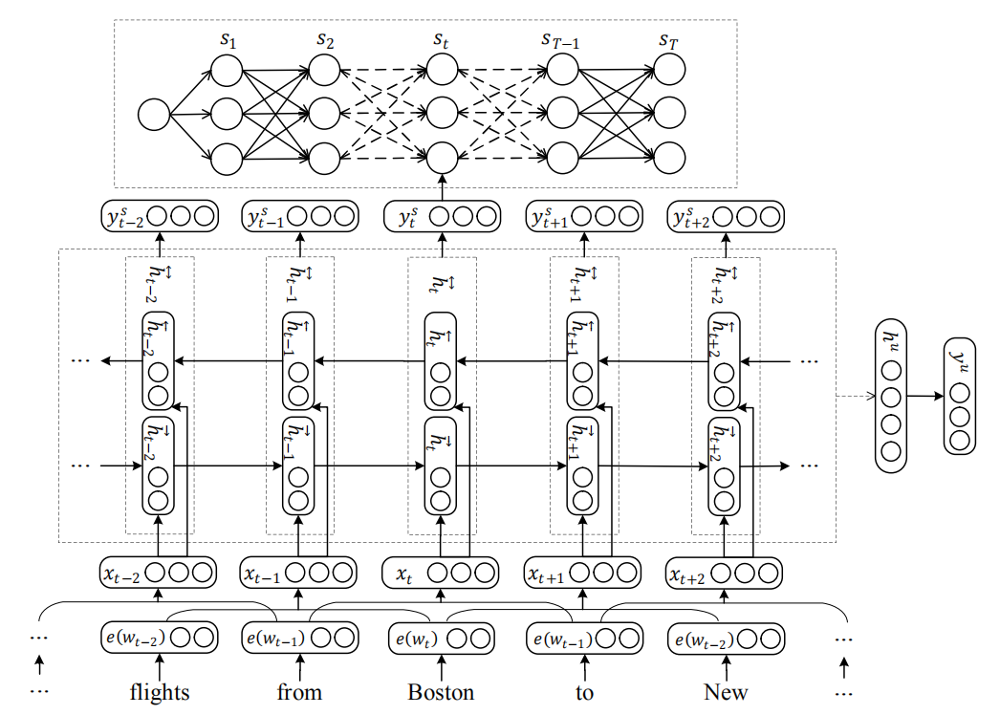
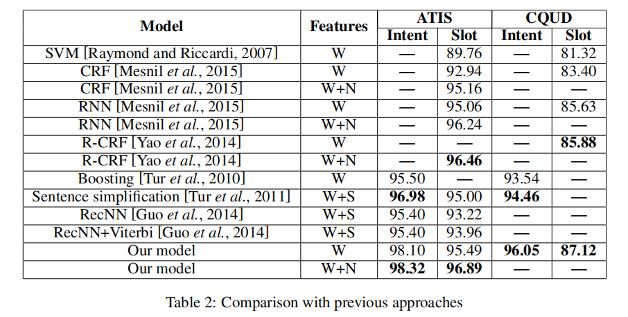
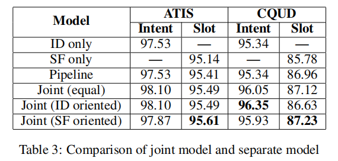

# Semantic Slot Filling Research Advances

This repo mainly summary latest research advances on semantic slot filling.

# Related Papers
1.[ Yao, Kaisheng, et al. "Recurrent neural networks for language understanding." Interspeech 2013.](https://www.isca-speech.org/archive/archive_papers/interspeech_2013/i13_2524.pdf)

- **Model**

    
- **DataSet**
    - ATIS 
    - CQUD (Chinese Question Understanding Dataset)
- **Experiment Result**

2.[ Mesnil, Grégoire, et al. "Using recurrent neural networks for slot filling in spoken language understanding." IEEE/ACM Transactions on Audio, Speech, and Language Processing 2015](https://ieeexplore.ieee.org/abstract/document/6998838)

3.[ Kurata, Gakuto, et al. "Leveraging sentence-level information with encoder lstm for semantic slot filling." EMNLP 2016](https://arxiv.org/abs/1601.01530.pdf)

4.[ Hakkani-Tür, Dilek, et al. "Multi-Domain Joint Semantic Frame Parsing Using Bi-Directional RNN-LSTM." Interspeech 2016](https://pdfs.semanticscholar.org/d644/ae996755c803e067899bdd5ea52498d7091d.pdf)

5.[ Zhang, Xiaodong, and Houfeng Wang. "A Joint Model of Intent Determination and Slot Filling for Spoken Language Understanding." IJCAI 2016](https://www.ijcai.org/Proceedings/16/Papers/425.pdf)

6.[ Liu, Bing, and Ian Lane. "Attention-based recurrent neural network models for joint intent detection and slot filling." Interspeech 2016](https://arxiv.org/abs/1609.01454)

7.[ Constantin, Stefan, Jan Niehues, and Alex Waibel. "Multi-task learning to improve natural language understanding." 2018](https://arxiv.org/abs/1812.06876.pdf)

8.[ Zhao, Lin, and Zhe Feng. "Improving Slot Filling in Spoken Language Understanding with Joint Pointer and Attention." ACL 2018](http://www.aclweb.org/anthology/P18-2068)

9.[ Gong, Yu, et al. "Deep Cascade Multi-task Learning for Slot Filling in Online Shopping Assistant." 2019](http://www.cs.sjtu.edu.cn/~kzhu/papers/kzhu-slot.pdf)
